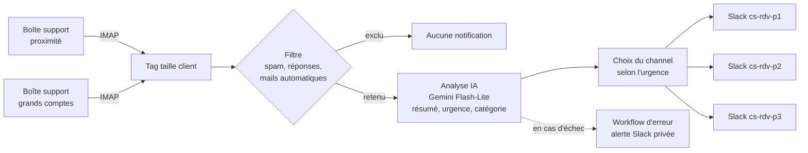

# m2-n8n — Tri et notification automatiques des mails support

Un workflow **n8n** qui lit les mails arrivant au support, en estime l'urgence avec une IA et prévient l'équipe dans le bon channel Slack. Il est construit et maintenu avec trois **skills Claude Code** qui encadrent chaque phase du travail.

## Le problème

Le support de Troov reçoit les demandes clients sur deux adresses : l'une pour les clients de proximité, l'autre pour les grands comptes. L'équipe (2 personnes) doit repérer vite les demandes urgentes et savoir de quel type de client elles viennent, sans surveiller les boîtes mail en continu.

## La solution



- **3 niveaux d'urgence** : P1 (service bloqué, usagers impactés, sécurité, client très mécontent), P2 (dans la journée), P3 (peut attendre).
- **Un channel privé par priorité**. Le type de client est affiché en tête de chaque notification.
- **Aucun mail perdu en silence** : une réponse d'IA inexploitable est classée P3 par défaut, les envois Slack sont réessayés, et tout échec déclenche une alerte.

Détails : [spec complète](docs/spec-tri-mails-support.md).

## Résultats des tests (30/09)

| Cas testé | Résultat |
|---|---|
| Mail urgent (plus aucune prise de RDV possible) | ✅ P1, channel `cs-rdv-p1`, en-tête PROXIMITÉ |
| Mail à traiter dans la journée (grands comptes) | ✅ P2, channel `cs-rdv-p2`, en-tête GRANDS COMPTES |
| Question non urgente | ✅ P3, channel `cs-rdv-p3`, en-tête PROXIMITÉ |
| Échec d'envoi Slack | ✅ Alerte d'erreur reçue |
| Réponse dans un fil existant | ⏳ À tester |
| Newsletter, expéditeur automatique | ⏳ À tester |

Les problèmes rencontrés en route et les décisions prises sont tracés dans le [journal de bord](docs/journal-de-bord.md).

## Méthode : 10 / 80 / 10

Le travail est encadré par trois skills Claude Code, une par phase :

| Phase | Part | Skill | Rôle |
|---|---|---|---|
| Avant | 10 % | [`interview`](skills/interview/SKILL.md) | Faire tout dire, demander des exemples concrets, challenger et simplifier le besoin, puis rédiger une spec validée avant de construire |
| Pendant | 80 % | [`doubt-driven-dev`](skills/doubt-driven-dev/SKILL.md) | Construire en doutant : tests écrits avant le code, chaque hypothèse prouvée par une exécution, débogage par la cause, journal de bord |
| Après | 10 % | [`hostile-review`](skills/hostile-review/SKILL.md) | Relire en adversaire, en lecture seule, avec des défauts démontrés et un verdict clair |

Chaque skill a une partie générale, valable pour tout projet, et une référence propre à n8n.

## Contenu du repo

```
├── docs/
│   ├── spec-tri-mails-support.md   spec du workflow (besoin, règles, critères de réussite)
│   └── journal-de-bord.md          surprises et décisions en cours de construction
├── workflows/
│   ├── tri-mails-support.workflow.ts   workflow principal (v2)
│   ├── alerte-erreurs.workflow.ts      workflow d'erreur
│   └── archive/
│       └── v1-tri-mails-freshdesk.workflow.ts   première version, faite à la main (déclenchée par Freshdesk)
└── skills/
    ├── interview/
    ├── doubt-driven-dev/
    └── hostile-review/
```

Les workflows sont au format TypeScript de `@n8n/workflow-sdk`, synchronisés avec l'instance n8n via `n8ncli`.

## Limites et suite

- **À tester** : la détection des réponses dans un fil et l'exclusion des newsletters.
- **Lien vers le mail et historique** : dépendent de la décision de conserver ou non Freshdesk.
- **RGPD** : le contenu envoyé à l'IA et affiché dans Slack doit être validé en interne avant la mise en production.

## Données anonymisées

Les fichiers publiés ici sont une copie anonymisée de l'espace de travail : adresses mail, IDs Slack, IDs de credentials et de webhooks ont été remplacés par des valeurs d'exemple (`example.com`, `C0EXEMPLE01`, `CREDENTIAL_ID`…). Aucun secret (token, mot de passe, clé API) n'est versionné. Pour réutiliser un workflow, remplacer ces valeurs par les vôtres et connecter vos propres credentials dans n8n.

## Licence

[MIT](LICENSE). Les skills s'inspirent de projets open source : voir [NOTICE](NOTICE).
