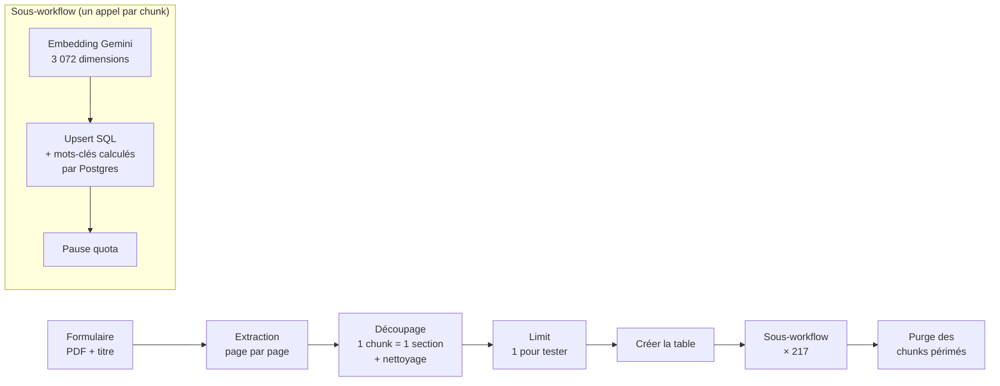
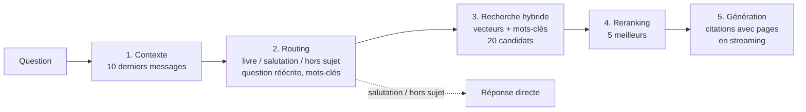

# m2-n8n

Projet de M2 construit avec **n8n** : un **RAG** sur *Le Capital au XXIe siècle* (Thomas Piketty, 2013), développé en trois versions comparables côte à côte. S'y ajoute une application en entreprise, le tri automatique des mails d'un support client. Les deux projets suivent une même méthode, outillée par trois **skills Claude Code**.

   

| Dossier | Contenu |
|---|---|
| [`rag-piketty/`](rag-piketty/) | **Le RAG** : 5 workflows, l'interface web, 5 specs |
| [`tri-mails-support/`](tri-mails-support/) | Tri et notification des mails support (IA + Slack) |
| [`skills/`](skills/) | Skills `interview`, `doubt-driven-dev`, `hostile-review` |
| [`docs/journal-de-bord.md`](docs/journal-de-bord.md) | Surprises et décisions, au fil de la construction |

**Sommaire** : [1. RAG Piketty](#1-rag-piketty) · [2. Tri des mails support](#2-application-en-entreprise--tri-des-mails-support) · [3. Méthode](#3-méthode--10--80--10) · [4. n8ncli](#4-workflows-as-code-avec-n8ncli) · [5. Réutiliser](#5-réutiliser-les-workflows)

---

## 1. RAG Piketty

On envoie le PDF du livre (1 046 pages) par un formulaire, puis on lui pose des questions depuis une page web. La réponse s'appuie **uniquement sur le livre** et **cite un extrait avec ses pages**. Si le livre ne répond pas, elle dit exactement « Je ne trouve pas cette information dans le livre. »

**Pile** : n8n Cloud · Google Gemini (`gemini-embedding-2` pour les vecteurs, `gemini-flash-lite-latest` pour le texte), en niveau gratuit · Supabase Postgres + pgvector.

### Les trois versions

| | V1 | V2 | V3 |
|---|---|---|---|
| **Découpage** | 2 pages par chunk (505) | **1 section** de la table des matières (217) | idem V2 |
| **Recherche** | vecteurs | vecteurs | **hybride** : vecteurs + mots-clés |
| **Tri des résultats** | aucun | aucun | **reranking** (20 → 5) |
| **Pilotage** | agent (l'IA décide quand chercher) | agent | **pipeline fixe en 5 étapes** |
| **Questions de suivi** | mémoire de l'agent | mémoire de l'agent | question réécrite explicitement |
| **Affichage** | d'un bloc | d'un bloc | en flux (streaming) |

Une page de comparaison permet de poser la même question aux trois versions, chacune avec sa propre conversation.

### Ingestion (V2)



Chaque chunk commence par l'en-tête `Partie / Chapitre / Section`, pour que le titre de section soit vectorisé et indexé. L'introduction d'un chapitre est collée à sa première section. La colonne `mots_cles` (`tsvector`, configuration `french`) donne plus de poids au titre de section qu'au texte.

### Réponse (V3)



- **Recherche hybride** : une seule requête SQL fusionne le classement par vecteurs et le classement par mots-clés (*reciprocal rank fusion*, poids 0,5 / 0,5).
- **Replis** : si Gemini est lent ou renvoie un JSON invalide au routing ou au reranking, le pipeline continue avec la question brute ou l'ordre de la recherche.
- **Sans nœud Code** : les transformations sont des expressions n8n, ce qui évite ~1,7 s de démarrage du moteur de code à chaque question.

### Résultats

Questions de test de la spec :
- **A** : « Qu'est-ce que la première loi fondamentale du capitalisme ? »
- **B** : « Comment Piketty évalue-t-il la valeur des esclaves dans le capital américain ? »
- **C** : « Que dit Piketty de la croissance démographique sur le très long terme ? »

| | A | B | C |
|---|---|---|---|
| **V1** (2 pages par chunk) | ✅ | non mesuré | ✅ 3/3 |
| **V2** (1 section par chunk) | ❌, puis ✅ une fois le titre de section vectorisé | ✅ | ❌ (pas rejoué après l'ajout du titre) |
| **V3** (pipeline en 5 étapes) | ✅ 3/3 | ✅ 3/3 | ⚠️ 1/3 (cite la section voisine) |

Ce que les mesures ont appris :
- **Le sens ne suffit pas.** Pour A, la bonne section arrivait 8ᵉ avec les vecteurs seuls, et 1ʳᵉ avec la recherche hybride.
- **Les accents comptent.** « inegalites aux Etats-Unis » trouvait 0 passage en mots-clés, contre 73 avec les accents. Le routing doit garder les accents.
- **Un chunk par section entière dilue le sujet.** La V2 progresse nettement dès que le titre de section est vectorisé avec le texte.
- **Vitesse V3** : premier texte affiché en 4,4 à 4,8 s quand Gemini répond normalement, jusqu'à ~14 s quand le niveau gratuit ralentit.

Détails, mesures et causes : [journal de bord](docs/journal-de-bord.md) et [specs](rag-piketty/specs/).

### Fichiers

```
rag-piketty/
├── specs/       1-rag-v1 · 2-interface · 3-ameliorations · 4-v2-un-chunk-par-section · 5-v3-reponse-en-5-etapes
├── workflows/   v1-ingestion-et-chat · v1-page · v2-ingestion · v3-reponse · page-comparaison
└── interface/   page du RAG, page de comparaison V1 / V2 / V3, build.py (injecte la page dans le workflow)
```

### Limites connues

- Question C : la V3 cite souvent la section voisine. Le reranking ne lit que les 1 500 premiers caractères de chaque section.
- Niveau gratuit de Gemini : ~15 générations par minute, et une question V3 en consomme jusqu'à 3. Laisser ~15 s entre deux questions pendant une démo.
- Pas de verrou contre deux envois simultanés du formulaire d'ingestion.

---

## 2. Application en entreprise : tri des mails support

Un workflow qui lit les mails arrivant sur deux adresses support, en estime l'urgence avec Gemini (P1 / P2 / P3) et prévient l'équipe dans un channel Slack privé par priorité. Le type de client est affiché en tête de chaque notification, et un workflow d'erreur alerte en cas de panne.

- **Testé** : 3 mails réels, chacun classé et notifié dans le bon channel ; l'alerte d'erreur s'est déclenchée comme prévu.
- **Reste à tester** : réponses dans un fil, newsletters.

Voir la [spec](tri-mails-support/spec.md) et les [workflows](tri-mails-support/workflows/). La première version, faite à la main et déclenchée par Freshdesk, est dans `archive/`.

---

## 3. Méthode : 10 / 80 / 10

| Phase | Part | Skill | Rôle |
|---|---|---|---|
| Avant | 10 % | [`interview`](skills/interview/SKILL.md) | Faire tout dire, demander des exemples concrets, challenger et simplifier, puis écrire une spec validée avant de construire |
| Pendant | 80 % | [`doubt-driven-dev`](skills/doubt-driven-dev/SKILL.md) | Construire en doutant : tests avant le code, chaque hypothèse prouvée par une exécution, débogage par la cause, journal de bord |
| Après | 10 % | [`hostile-review`](skills/hostile-review/SKILL.md) | Relire en adversaire, en lecture seule, avec des défauts démontrés et un verdict clair |

Les specs de `rag-piketty/specs/` et le journal de bord sont produits par cette méthode. Chaque changement de cap (avenant) est ajouté à la spec concernée, puis validé avant d'être construit.

---

## 4. Workflows as code avec n8ncli

Les workflows ne sont pas retouchés directement dans l'éditeur n8n : ils sont écrits en TypeScript (`@n8n/workflow-sdk`), versionnés avec Git et synchronisés avec `n8ncli`.

| Commande | Rôle |
|---|---|
| `n8ncli pull` | récupère la version en ligne |
| `n8ncli validate` | vérifie le fichier avant de l'envoyer (version de nœud périmée, connexions) |
| `n8ncli diff` | compare le fichier local et la version en ligne |
| `n8ncli push` puis `publish` | envoie et active la nouvelle version |

Trois règles apprises en route :
- **Toujours `diff` avant `push`** : un credential branché dans l'éditeur mais absent du fichier serait effacé.
- **« Push complete » n'est pas une preuve** : relire la version en ligne après chaque envoi.
- **Pas de `}}` dans une expression n8n** (par exemple dans un schéma JSON) : il ferme l'expression. Écrire `} }`.

---

## 5. Réutiliser les workflows

Les fichiers publiés ici sont une **copie anonymisée** de l'espace de travail. Les adresses mail, l'URL de l'instance n8n, les IDs Slack, les IDs de credentials, de webhooks et de formulaires ont été remplacés par des valeurs d'exemple (`example.com`, `votre-instance.app.n8n.cloud`, `CREDENTIAL_ID`…). Aucun secret (token, mot de passe, clé API) n'est versionné.

Pour relancer le RAG :
1. Créer dans n8n un credential **Google Gemini (PaLM) API** et un credential **Postgres** vers Supabase (pooler de connexion), puis remplacer les `CREDENTIAL_ID`.
2. Importer `v2-ingestion` et `v3-reponse`, puis `page-comparaison` (et `v1-*` pour comparer avec la V1).
3. Dans `v2-ingestion`, laisser `Limit Test` à 1, envoyer le PDF par le formulaire et vérifier la ligne créée dans `rag_piketty_v2_chunks`. Passer ensuite à 1000 pour tout le livre (~25 min en niveau gratuit).
4. Ouvrir `GET /webhook/rag-piketty-v2` : c'est la page de comparaison.

Pour modifier l'interface : éditer le HTML dans `rag-piketty/interface/`. `build.py` l'injecte dans le nœud qui sert la page. Il est écrit pour l'arborescence de l'espace de travail (`interface/` et `n8n/workflows/` côte à côte) : adapter les chemins avant de l'utiliser ici, ou coller le HTML à la main dans le nœud « Servir Page ».

## Licence

[MIT](LICENSE). Les skills s'inspirent de projets open source : voir [NOTICE](NOTICE).
