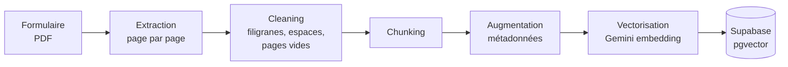
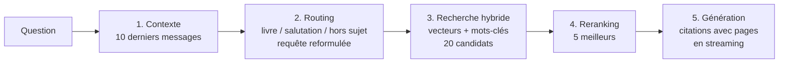

# m2-n8n

Projet de M2 construit avec **n8n** : un **RAG** complet sur *Le Capital au XXIe siècle* (Thomas Piketty, 2013), développé en trois versions. S'y ajoute une application en entreprise, le tri automatique des mails d'un support client. Les deux projets sont menés avec trois **skills Claude Code** qui encadrent chaque phase du travail.

| Dossier | Contenu |
|---|---|
| [`rag-piketty/`](rag-piketty/) | **Le RAG** : 5 workflows, l'interface web, 5 specs |
| [`tri-mails-support/`](tri-mails-support/) | Tri et notification des mails support (IA + Slack) |
| [`skills/`](skills/) | Skills `interview`, `doubt-driven-dev`, `hostile-review` |
| [`docs/journal-de-bord.md`](docs/journal-de-bord.md) | Surprises et décisions, au fil de la construction |

---

## 1. RAG Piketty

Envoyer le PDF du livre, puis lui poser des questions. La réponse s'appuie **uniquement sur le livre**, **cite les pages**, et dit « Je ne trouve pas cette information dans le livre. » quand c'est le cas.

**Pile** : n8n Cloud · Google Gemini (`gemini-embedding-2`, `gemini-flash-lite-latest`) · Supabase Postgres + pgvector.

### Ingestion



| | V1 | V2 |
|---|---|---|
| **Chunk** | 2 pages (~505 chunks) | **1 section** de la table des matières (217 chunks) |
| **Augmentation** | titre, pages | titre, partie, chapitre, section, pages ; titre de section en tête du texte vectorisé ; colonne de **mots-clés** (`tsvector`) |
| **Écriture** | PGVector Store, table reconstruite puis publiée d'un coup | sous-workflow par chunk : embedding (HTTP) → upsert SQL paramétré |

### Réponse



- **V1 et V2** : un agent LangChain décide seul quand chercher, avec une recherche vectorielle uniquement.
- **V3** : un pipeline explicite en 5 étapes, sans agent. Recherche hybride (fusion des rangs vecteurs / mots-clés, poids 0,5 / 0,5), reranking par Gemini, réponse en streaming, replis prévus à chaque étape.

### Résultats

Questions de test de la spec :
- **A** : « Qu'est-ce que la première loi fondamentale du capitalisme ? »
- **B** : « Comment Piketty évalue-t-il la valeur des esclaves dans le capital américain ? »
- **C** : « Que dit Piketty de la croissance démographique sur le très long terme ? »

| | A | B | C |
|---|---|---|---|
| **V1** (2 pages par chunk) | ✅ | non mesuré | ✅ 3/3 |
| **V2** (1 section par chunk) | ❌, puis ✅ une fois le titre de section vectorisé | ✅ | ❌ (pas rejoué après l'ajout du titre) |
| **V3** (pipeline en 5 étapes) | ✅ 3/3 | ✅ 3/3 | ⚠️ 1/3 (cite la section voisine) |

- **Vitesse V3** : premier texte affiché en 4,4 à 13,9 s, selon la latence de Gemini en niveau gratuit.
- **Enseignement principal** : un chunk par section entière dilue le sujet. La V2 progresse nettement dès que le titre de section est vectorisé avec le texte.

Détails, mesures et causes : [journal de bord](docs/journal-de-bord.md) et [specs](rag-piketty/specs/).

### Fichiers

```
rag-piketty/
├── specs/       1-rag-v1 · 2-interface · 3-ameliorations · 4-v2-un-chunk-par-section · 5-v3-reponse-en-5-etapes
├── workflows/   v1-ingestion-et-chat · v1-page · v2-ingestion · v3-reponse · page-comparaison
└── interface/   page du RAG, page de comparaison V1 / V2 / V3, build.py (injecte la page dans le workflow)
```

---

## 2. Application en entreprise : tri des mails support

Un workflow qui lit les mails arrivant sur deux adresses support, en estime l'urgence avec Gemini (P1 / P2 / P3) et prévient l'équipe dans un channel Slack privé par priorité. Le type de client est affiché en tête de chaque notification, et un workflow d'erreur alerte en cas de panne.

- **Testé** : 3 mails réels, chacun classé et notifié dans le bon channel ; l'alerte d'erreur s'est déclenchée comme prévu.
- **Reste à tester** : réponses dans un fil, newsletters.

Voir la [spec](tri-mails-support/spec.md) et les [workflows](tri-mails-support/workflows/). La première version, faite à la main et déclenchée par Freshdesk, est dans `archive/`.

---

## 3. Méthode : 10 / 80 / 10

| Phase | Part | Skill | Rôle |
|---|---|---|---|
| Avant | 10 % | [`interview`](skills/interview/SKILL.md) | Faire tout dire, demander des exemples concrets, challenger et simplifier, puis écrire une spec validée avant de construire |
| Pendant | 80 % | [`doubt-driven-dev`](skills/doubt-driven-dev/SKILL.md) | Construire en doutant : tests avant le code, chaque hypothèse prouvée par une exécution, débogage par la cause, journal de bord |
| Après | 10 % | [`hostile-review`](skills/hostile-review/SKILL.md) | Relire en adversaire, en lecture seule, avec des défauts démontrés et un verdict clair |

Les specs de `rag-piketty/specs/` et le journal de bord sont produits par cette méthode.

---

## Données anonymisées

Les fichiers publiés ici sont une copie anonymisée de l'espace de travail. Les adresses mail, l'URL de l'instance n8n, les IDs Slack, les IDs de credentials, de webhooks et de formulaires ont été remplacés par des valeurs d'exemple (`example.com`, `votre-instance.app.n8n.cloud`, `CREDENTIAL_ID`…). Aucun secret (token, mot de passe, clé API) n'est versionné. Pour réutiliser un workflow, remplacer ces valeurs par les vôtres et connecter vos propres credentials dans n8n.

## Licence

[MIT](LICENSE). Les skills s'inspirent de projets open source : voir [NOTICE](NOTICE).
